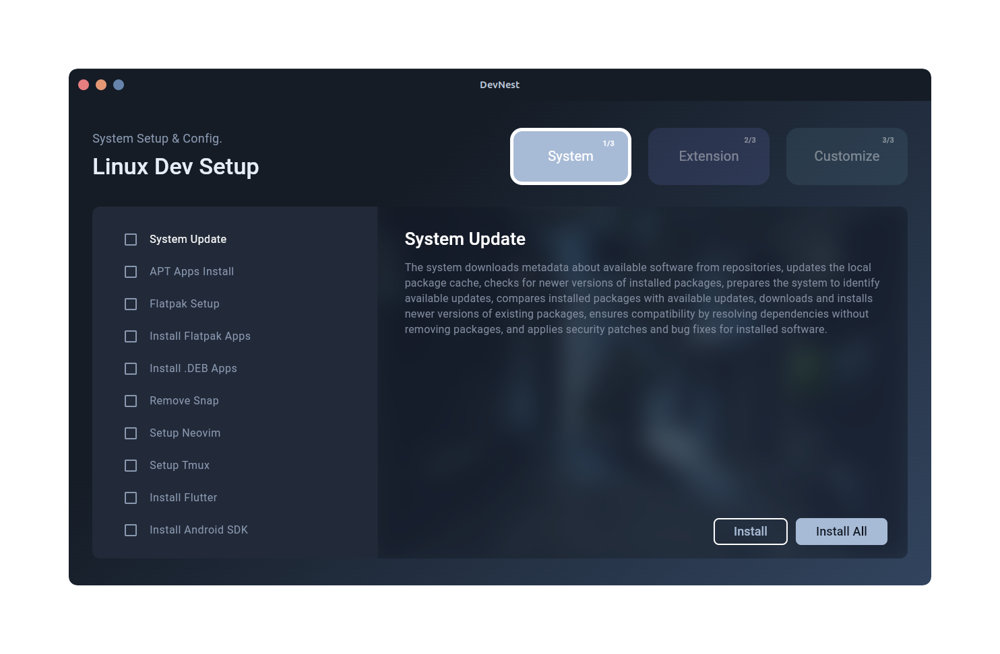
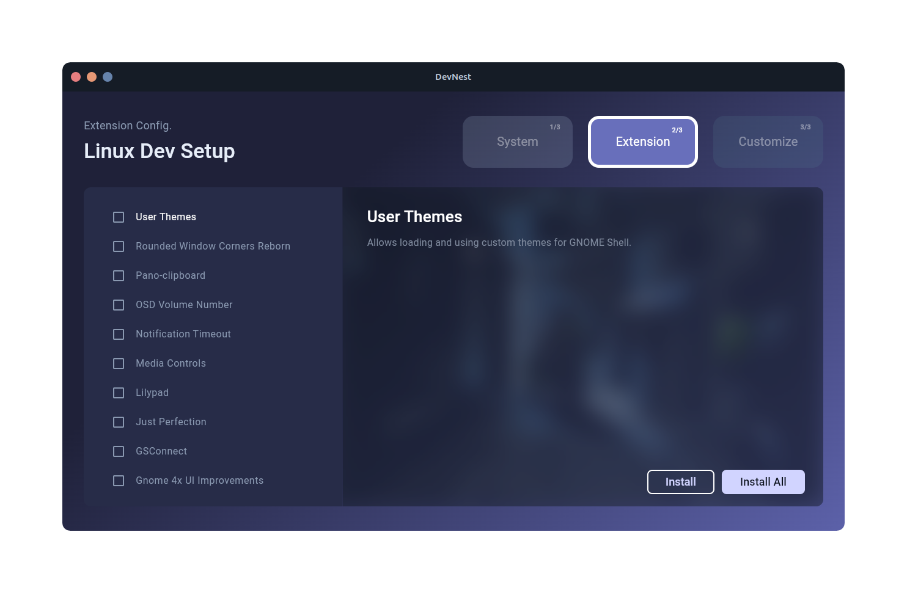
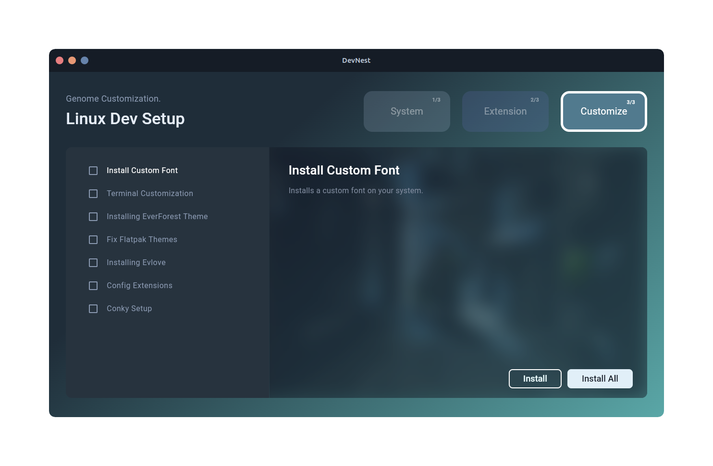
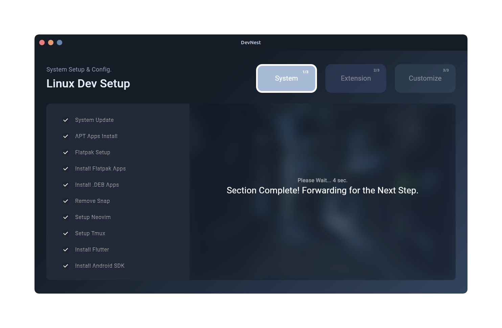

<div align="center">
   <picture>
      
   </picture>
   <h2>Devnest</h2>
</div>
<div align="center">


| Developer-friendly  automate the System setup & config Linux applications |
|-----------------------------------------|
</div>

# Devnest
DevNest is a Linux desktop app developed in Flutter, designed to automate the setup of a developer-friendly environment. It handles system updates, app installations, Flatpak setup, GNOME extensions, desktop wallpaper, and configurations for tools like Neovim, tmux, Conky, GitHub SSH, Linux Bash aliases, Flutter setup, GCC for C++, Node.js, and more. DevNest allows you to quickly set up your Linux desktop from scratch, saving you time on system configuration.

<!--  -->
<div align="center">
   
   <picture>
      
   </picture>
   <picture>
      
   </picture>
   <picture>
      
   </picture>
    <picture>
      
   </picture>
</div>

## Features

- **System Updates:** Keep your system up to date with ease.
- **App Installations:** Automatically installs essential applications for developers.
- **Flatpak Setup:** Configures Flatpak for easy installation of apps.
- **GNOME Extensions:** Set up GNOME extensions to enhance your desktop experience.
- **Desktop Wallpaper:** Automatically set up your preferred desktop wallpaper.
- **Neovim Configuration:** Get your Neovim environment ready for coding.
- **tmux Configuration:** Automatically set up tmux for terminal multiplexing.
- **Conky Setup:** Configure Conky for a customizable system monitor on your desktop.
- **GitHub SSH:** Automatically set up SSH keys for GitHub integration.
- **Linux Bash Aliases:** Set common aliases in your Linux Bash shell for easier command execution.
- **Flutter Setup:** Installs and configures Flutter for mobile and web development.
- **GCC for C++:** Installs and configures GCC for C++ development.
- **Node.js Setup:** Installs and configures Node.js for JavaScript development.

## Installation Guide for DevNest

Follow these steps to install DevNest on your Linux system:

---

### Step 1: Download the Latest Release
1. Go to the [DevNest Releases Page](#) (replace `#` with the actual link).
2. Download the `.deb` package of the latest release.

---

### Step 2: Install the Package
You can use either `apt` or `dpkg` to install the package.

#### Option 1: Using `apt`
1. Open a terminal.
2. Navigate to the directory where the `.deb` file was downloaded:
   ```bash
   cd /path/to/download/directory
   ```
3. Run the following command to install DevNest:
   ```bash
   sudo apt install ./devnest*.deb
   ```

#### Option 2: Using `dpkg`
1. Open a terminal.
2. Navigate to the directory where the `.deb` file was downloaded:
   ```bash
   cd /path/to/download/directory
   ```
3. Run the following command to install DevNest:
   ```bash
   sudo dpkg -i devnest*.deb
   ```
4. If you encounter dependency errors, fix them by running:
   ```bash
   sudo apt --fix-broken install
   ```

---

### Step 3: Launch DevNest
Once installed, you can launch DevNest from your applications menu or by running:
```bash
devnest
```

---


## Usage

- Launch the app after installation.
- DevNest will automatically begin the setup process based on your selected options.
- Once completed, your Linux desktop will be fully configured for development.

---
## Contributing

Contributions are welcome! If you'd like to contribute to DevNest, please fork the repository, create a new branch, and submit a pull request with your changes.

1. Fork the repository.
2. Create a new branch for your feature:
   ```bash
   git checkout -b feature-name
   ```
3. Commit your changes:
   ```bash
   git commit -m "Add new feature"
   ```
4. Push to the branch:
   ```bash
   git push origin feature-name
   ```
5. Open a pull request.# My Project
